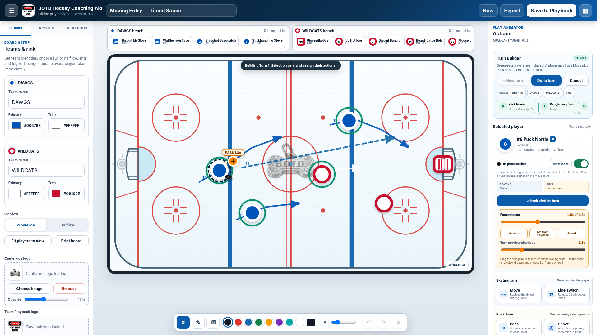

# BOTD Hockey Coaching Aid v3.3

A standalone, browser-based hockey coaching board created by **Nicholas Heller**.

## Live site

GitHub Pages serves the application from `index.html`.

## Deployment

Upload every file in this folder directly to the repository root. The first line of `index.html` must be `<!doctype html>`. Do not rename `README.md` to `index.html`.

In **Settings > Pages**, select **Deploy from a branch**, branch `main`, folder `/ (root)`.

## Local data

Plays are stored in the browser. Use **Export playbook** and **Import JSON** to transfer them between the local file and the hosted site.
