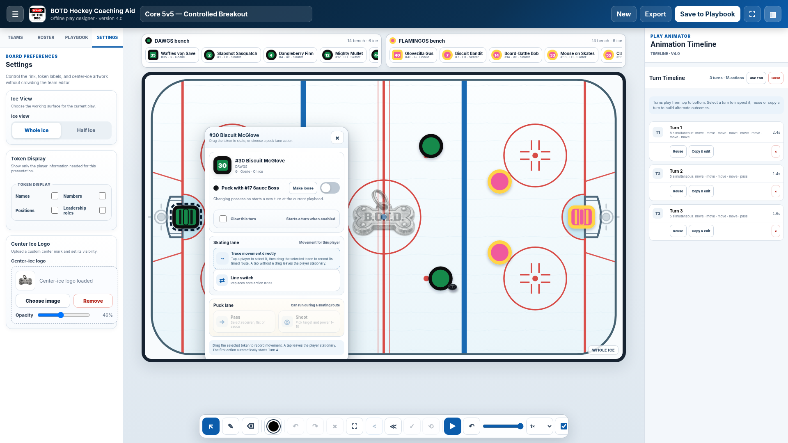

# BOTD Hockey Coaching Aid v4.0

A standalone, browser-based hockey tactics board created by **Nicholas Heller**. Version 4.0 supports mouse, touch, and Apple Pencil play design; turn-based animation; live telestration; team and roster editing; playbook storage; and reversible playback.

## GitHub Pages deployment

Upload every file in this package directly to the repository root. In **Settings → Pages**, deploy from the repository branch and `/ (root)`. The application entry point is `index.html`.

Do not upload the ZIP itself, and do not rename `README.md` to `index.html`.

## Files

- `index.html` — complete application
- `.nojekyll` — plain static-site configuration
- `BOTD_Hockey_Coaching_Aid_v4.0_Preview.png` — release preview
- `BOTD_Hockey_Coaching_Aid_v4.0_README.txt` — setup, release notes, limitations, and full version history

## Local data

Saved sessions and playbooks use browser-local storage. A local file and a GitHub Pages URL are different storage origins. Export playbook JSON before moving between addresses or devices.
